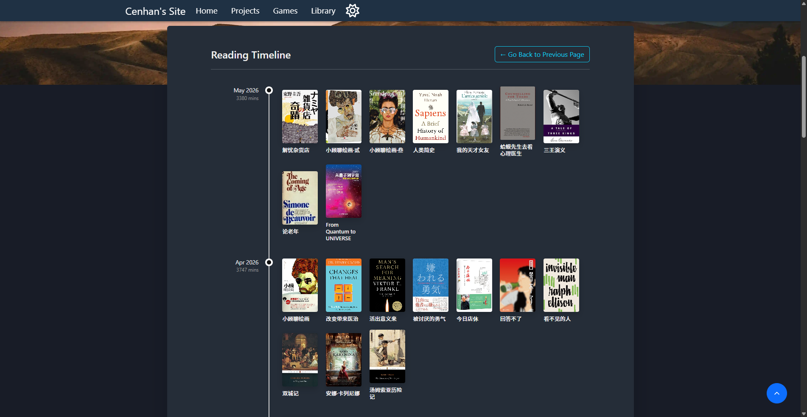
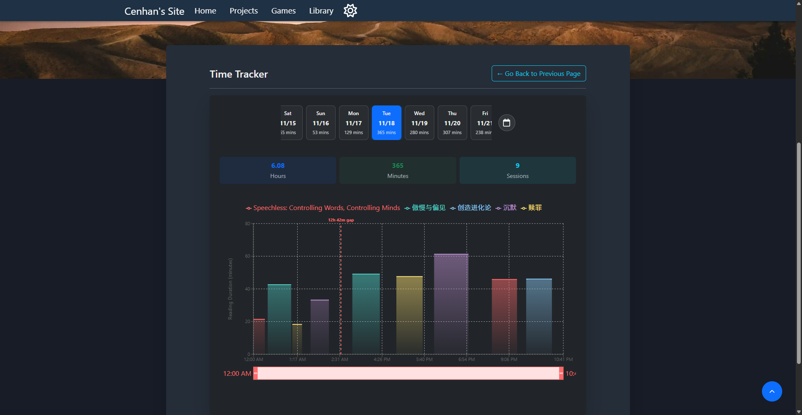

# Cenhan's Site

> My corner of the internet for keeping track of what I read and building small tools.

[Visit the site](https://www.ducenhan.com)

This is a personal website that I keep adding to over time. It is part reading log, part playground, and part home for the small tools and experiments I make along the way. I wanted one place that could hold all of those things without turning them into a polished portfolio or scattering them across different platforms.

## What's inside

### A place for my reading

The Library is the part I use the most. It keeps track of books I have read, what I am reading now, and what I want to read next, along with notes, quotes, ratings, tags, and reading dates.

The reading timeline gives me a more visual way to look back at that history. Instead of seeing the library as one long list, I can see when different books were finished and how much reading time went into each month.

I also bring in my Toggl reading sessions to see how my reading was spread across a day. The tracker below shows the busiest reading day in the current data, broken down by book and time of day.

The Library is mainly built around my own reading habits. There is also a small shared database that lets a few other people keep their own public or private shelves, but that is more of an extra than the main idea.

### Small things I build

I use the rest of the site as a home for projects, little web tools, demos, games, and experiments. Some of them come from everyday problems I wanted to make less annoying; others are simply things I built while learning or following an idea that seemed interesting.

The site also has a light and dark theme, and every page opens with a randomly selected quote from the public bookshelves.

## Built with

React · Vite · React Router · Firebase · Bootstrap · Recharts · Markdown

---

© 2026 Cenhan. All rights reserved.
